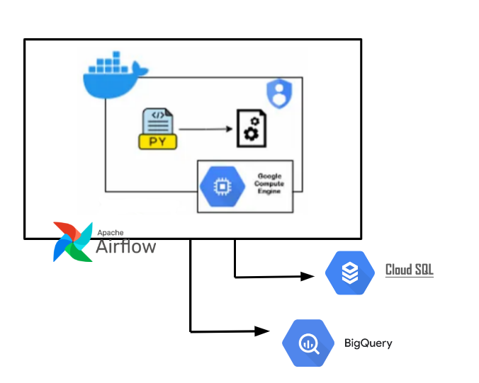

# Churn Prediction

## Table of Contents
* [About the Project](#about-the-project)
* [Getting Started](#getting-started)
    * [Prerequisites](#prerequisites)
    * [Installation](#Installation)
    * [Environment Variable](#environment-variable)
* [Author](#author)

<!-- About THE PROJECT -->
## [About The Project](#about-the-project)

The Churn Prediction project is an initiative that aims to improve customer retention by identifying customers who are most likely to churn. By predicting churn, we can take proactive measures to retain these customers, thereby enhancing customer loyalty and mitigating loss.

Following endpoints would be provided:
- /churn_score_generation: consists of creating temp feature table, predicting churn score using existing model, store result to bq, calculate psi to monitor feature data and calculate evaluation metrics on last month prediction data
- /job_status
- /churn_prediction: get churn score by customer_id (to note: ideally for data integration to the main app, we use faster db, such as Cloud SQL, but we utilize bigquery for this portfolio)

### Infrastructure


The implementation plan encompasses developing a RESTful API alongside the integration of a robust batching infrastructure. Upon deployment, the application (microservice) will operate within VM and Kubernetes. For task scheduling, Airflow will orchestrate API calls. Data generated and processed within the application (microservice) will be stored in BigQuery, including monitoring of both metrics and data skew.

Additionally, if necessary, to expedite data retrieval for the main application, Cloud SQL has been considered due to its superior speed and performance. **While the project only focuses on constructing the REST API and establishing data storage within BigQuery**, future iterations may involve leveraging Airflow for scheduling tasks or adapting scripts to accommodate storage in Cloud SQL.


## [Getting Started](#getting-started)

### [Prerequisites](#prerequisites)
* **Python 3.8+**
Please see pyproject.toml for the used libraries.

### [Installation](#Installation)

```
git clone https://github.com/deviyantiam/churn_prediction.git && cd churn_prediction/app
pre-commit init
poetry update
```

**if you use os other than windows, please toggle command asyncio in app.py
before running python app.py


### [Environment Variable](#environment-variable)
The project is configured via environment variables, i.e. file `.env` but we dont attach it here :P

## [Author](#author)
Deviyanti AM [linkedin](https://linkedin.com/in/deviyanti-am)